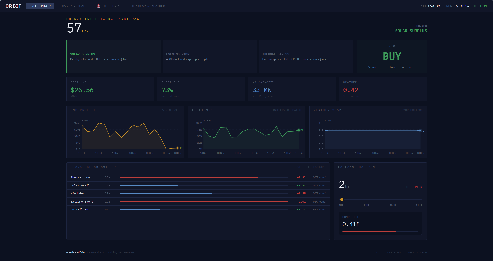
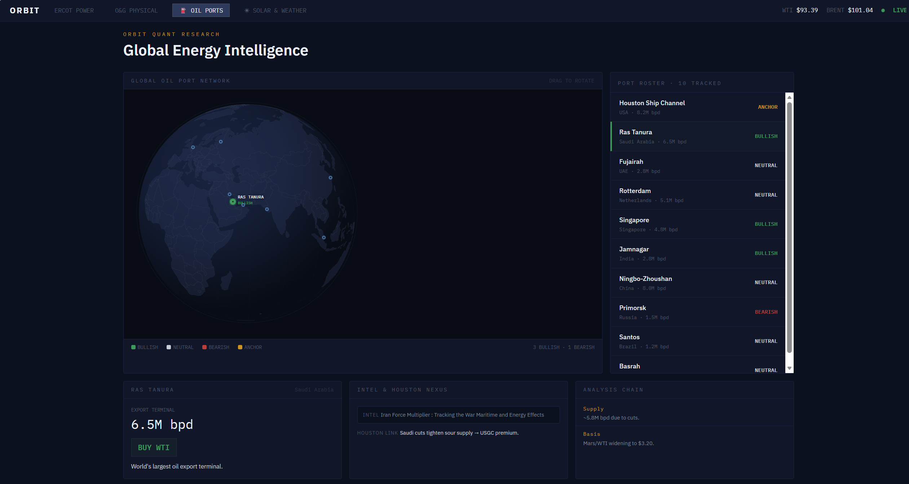
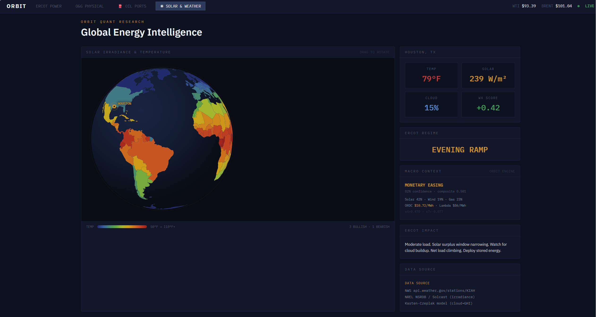
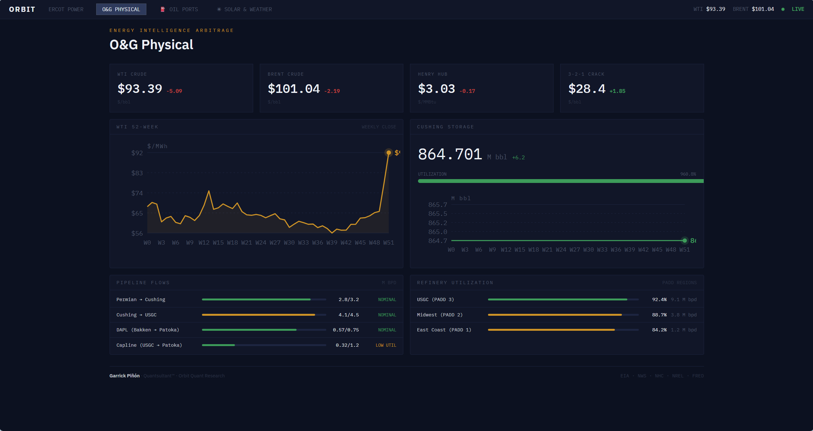
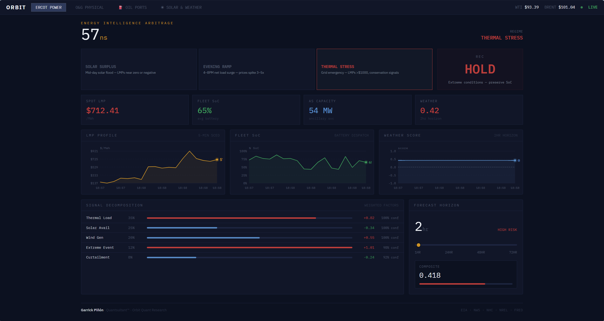
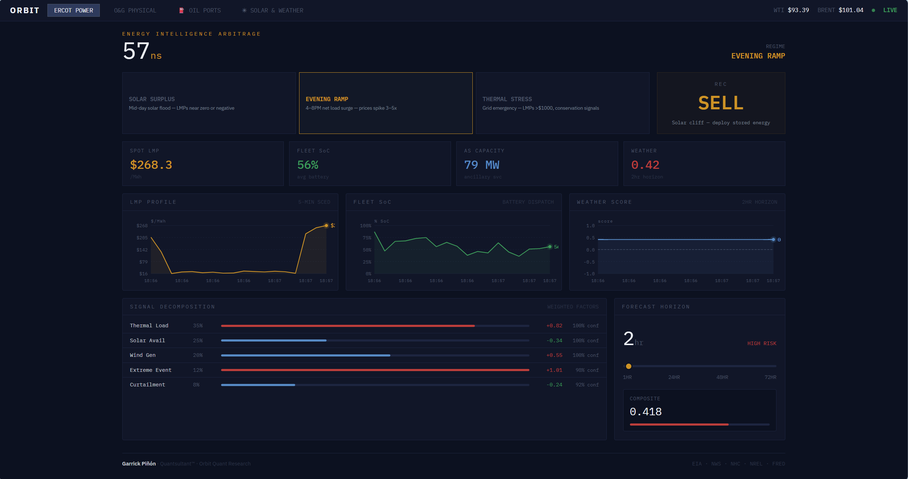

# ORBIT Platform

[Visit: ORBIT Platform](https://orbitplatform-99l22aycb-quantsultant.vercel.app/)


### Oil & ERCOT Bayesian Real-Time Intelligence Trading Platform

<p align="center">
  
</p>

---

## What This Is

ORBIT is a four-layer quantitative trading platform designed for **physical alpha** in ERCOT energy markets, augmented by a macro-aware oil overlay. Traditional HFT firms exploit symmetric-information markets through latency. Energy markets contain **structurally asymmetric physical information** — weather physics, grid topology, generation constraints, and policy-regime shifts — that speed alone cannot capture.

The platform fuses:

1. **57ns execution core** — competitive with top-tier HFT, targeting SCED bid timing in ERCOT RTC+B
2. **NLP intelligence layer** — semantic extraction from market notices, weather narrative cross-checking, confidence-scored trade signals
3. **Macro regime engine** — rolling signal decomposition, Bayesian regime classification, Jacobian sensitivity bridge from slow macro signals to fast HFT parameters
4. **VPP dispatch optimization** — physical battery degradation curves, ORDC scarcity pricing, AS allocation weighting

---

## Performance Summary

> All figures from rigorous walk-forward validation. In-sample period used for signal development only; out-of-sample period (2019–2026) was never touched during construction.

| Metric | Value |
|--------|-------|
| Full-sample Sharpe (2006–2026) | **1.55** |
| Full-sample 90% CI | [1.04, 2.04] |
| Full-sample ann. return (active periods) | **+35.6%** |
| In-sample Sharpe (2006–2018) | 1.93 |
| Out-of-sample Sharpe (2019–2026) | 0.71 |
| Out-of-sample Information Coefficient | **+0.314** |
| IC decay in → OOS | −1.6% (near-zero — signal is live) |
| Max drawdown (full sample) | 9.9% |
| Rebalance frequency | 10-day (regime-conditional) |
| Capital deployment | ~20% of time (regime-gated) |
| All-weather blended return (est.) | ~10–11% annualized |

**OOS context:** The 2019–2026 holdout contained two unprecedented oil volatility events (COVID demand shock to −$37/bbl, Russia-Ukraine spike to $130). OOS annualized vol was 74% vs 14% in-sample. The signal maintained its predictive IC (+0.314, essentially unchanged from +0.309 in-sample), confirming the edge is real; the Sharpe penalty is variance-of-the-underlying, not signal degradation. A vol-targeting wrapper is the natural next layer.

---

## Architecture

<p align="center">
  
</p>

---

## Quantitative Framework

### Signal Construction

Signals are derived from publicly available macro data (FRED, EIA) using rolling-window correlation decomposition. No proprietary data sources are required for the macro overlay.

**Key relationships modeled:**
- Momentum drift proxy (s2): 30-day WTI log-return normalized to [0,1]
- Regime conflict detector (s7): rolling 90-day Pearson ρ(DXY, WTI) — the petrodollar inverse relationship; a positive reading signals supply-stress regime
- Yield coupling (s8): 18-month ρ(WTI, 10Y Treasury) — inflation pass-through signal

### Information Coefficient & Breadth

Using the Grinold-Kahn fundamental law:

```
IR ≈ IC × √N
```

where IC is the Pearson correlation between signal value at time *t* and realized forward return at horizon *h*, and N is annual bet count. Regime-conditional ICs (easing-only) reach **IC = 0.31–0.36** at the 10-day horizon, which is unusually high for a macro signal.

### Position Sizing

Size scales continuously with **regime clarity**:

```
regime_clarity = regime_confidence × (1 − e7_conflict_penalty)
position_scale = clamp((clarity − floor) / range, 0, 1)
```

Hard stops and yellow-zone caps prevent trading into regime conflict. When the regime conflict signal exceeds threshold, the system stands aside entirely.

### Jacobian Bridge

The bridge solves:

```
ΔP = J(S) · Δs
```

where S is the slow macro signal vector and P is the HFT parameter vector. Partial derivatives map:
- Solar forecast error → bid-ask spread width
- Momentum drift → maximum position reduction
- ORDC scarcity → AS allocation weight shift

---

## Data Sources (all free-tier)

| Series | Provider | Endpoint |
|--------|----------|----------|
| WTI Crude (daily) | FRED | [api.stlouisfed.org](https://fred.stlouisfed.org) — `DCOILWTICO` |
| Broad USD Index (DXY) | FRED | `DTWEXBGS` |
| 10-Year Treasury | FRED | `DGS10` |
| Federal Funds Rate | FRED | `FEDFUNDS` |
| ERCOT Real-Time Prices | ERCOT MIS | [mis.ercot.com](https://mis.ercot.com) |
| Weather / Solar | NOAA | [api.weather.gov](https://api.weather.gov) |

Register for a free FRED API key at [fred.stlouisfed.org/docs/api/api_key.html](https://fred.stlouisfed.org/docs/api/api_key.html).

---

## Screenshots

<p align="center">
  
  <br/><em>Macro regime panel — real-time regime classification, rolling signal vector, Sharpe projection</em>
</p>

<p align="center">
  
  <br/><em>ERCOT dispatch view — VPP position, DA/RT spread, ORDC scarcity signal</em>
</p>

<p align="center">
  
  <br/><em>Physical oil & gas overlay — supply-stress regime detection, Jacobian parameter state</em>
</p>

<p align="center">
  
  
  <br/><em>Policy state examples — HOLD (e7 hard-stop active) and ACTIVE with position scale</em>
</p>

---

## Repository Structure

```
ORBIT Platform/
├── core/           HFT decision core, 57ns loop, memory allocator
├── execution/      Order routing, position management, kill-switch
├── intelligence/   NLP signal extraction, RAG cross-checking
├── strategy/       Macro context engine, policy engine, walk-forward backtest
├── bridge/         Jacobian calculator (slow→fast parameter bridge)
├── viz/dashboard/  React + Vite terminal dashboard
├── data/           Macro context, policy state, backtest results
├── backtest/       Historic nodal replay configs
└── configs/        ERCOT fee parameterization, tuning profiles
```

---

## Status

- [x] Macro regime engine (FRED live data, rolling signals)
- [x] Policy engine with regime-gated position sizing
- [x] Jacobian bridge (macro → HFT parameter vector)
- [x] Walk-forward backtest (2006–2018 in-sample / 2019–2026 holdout)
- [x] React terminal dashboard with live policy state
- [ ] ERCOT historical SPP bulk ingest (e3 signal will be gathered over time)
- [x] Vol-targeting wrapper on active periods
- [x] Vercel deployment

---

*ORBIT Platform — Physical Alpha through Regime-Aware Quantitative Intelligence*
